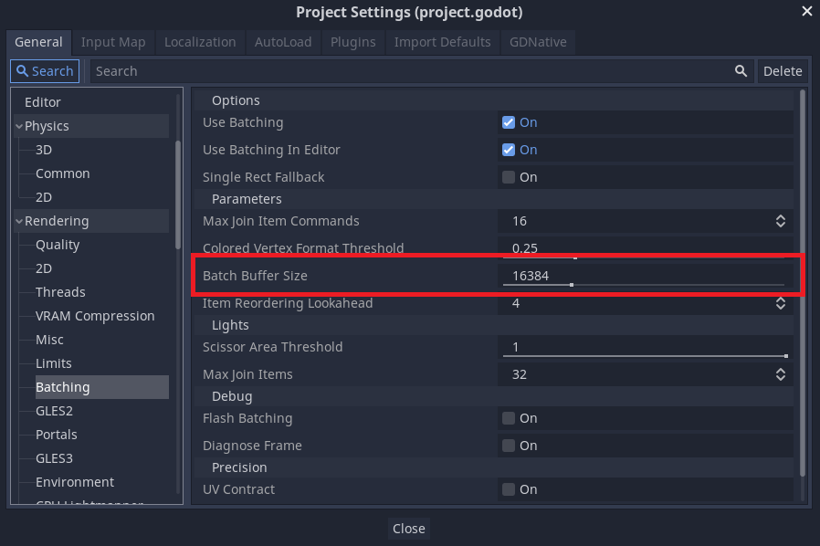
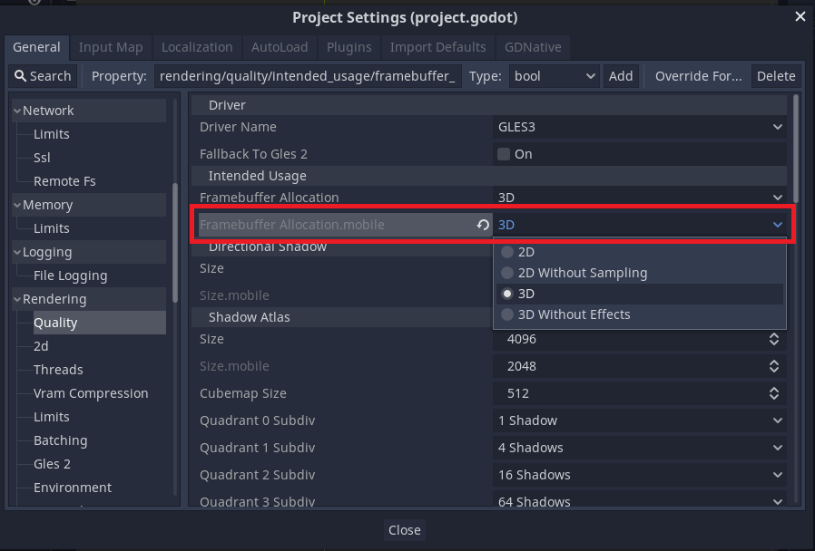
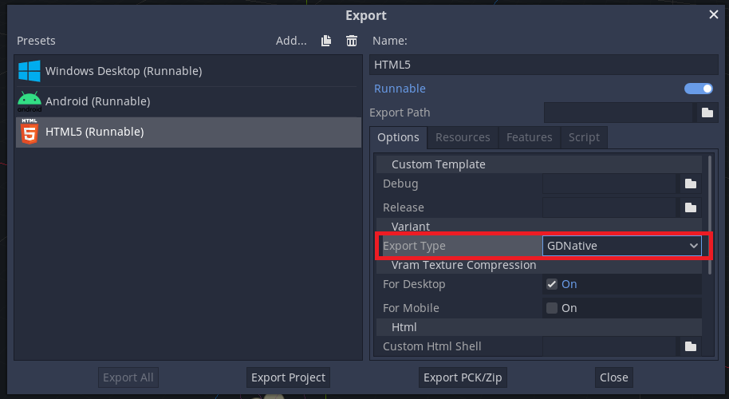

# FAQ

## Common

### WARNING: poly has too many indices to draw, increase batch buffer size
If you get the above warning when drawing 2D, increase the `Batch Buffer Size` in the project settings.

## Mobile (iOS/Android)

### Distortion and Soft particle not work
The following Effekseer features will not work with the default settings on mobile targets.

- Distortion shader
- Soft particles

For the above effects to work, you need to set `3D` or `2D` to `Framebuffer Allocation.mobile` in` Quality` of Godot's `project settings`.

## HTML5

### Effekseer not work in HTML5
The `Export Type` must be set to` GDNative` to enable the Effekseer plugin on HTML5 targets.

