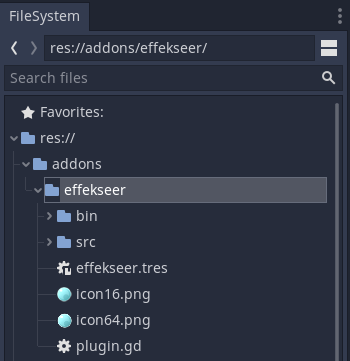
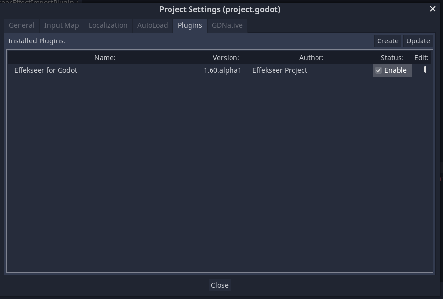
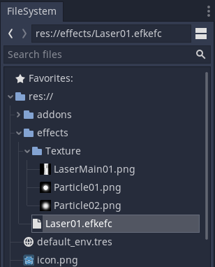
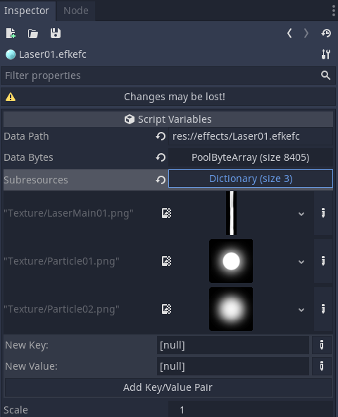
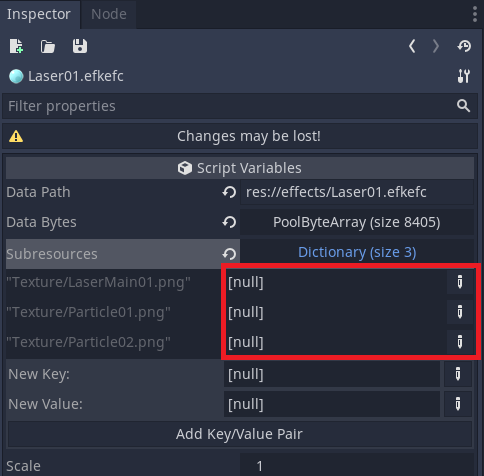
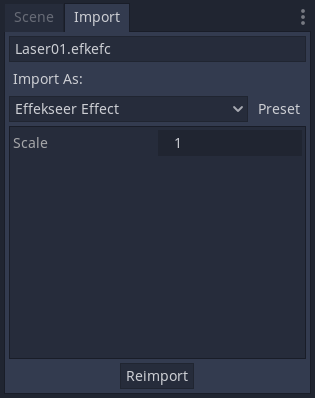
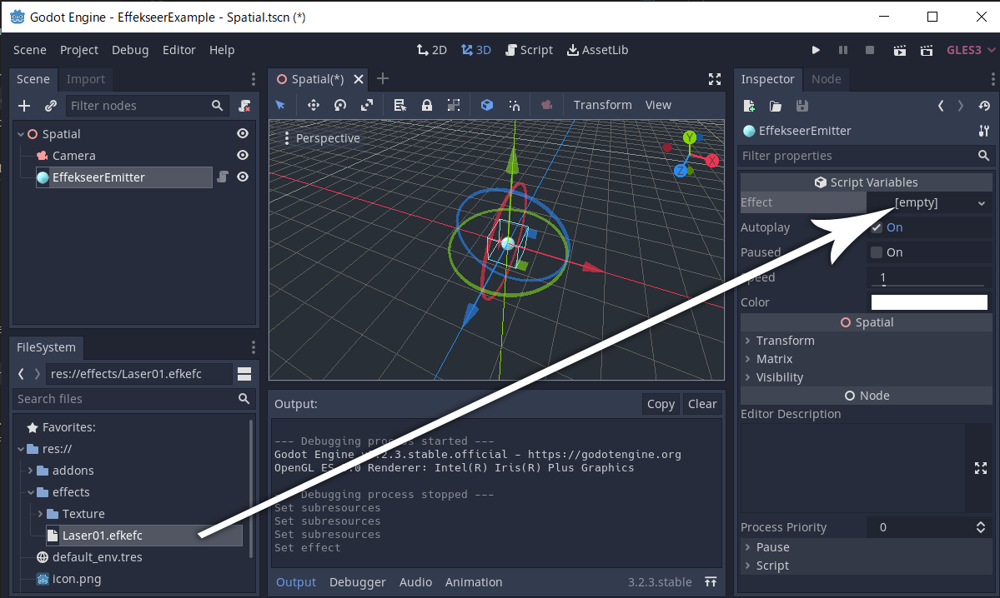
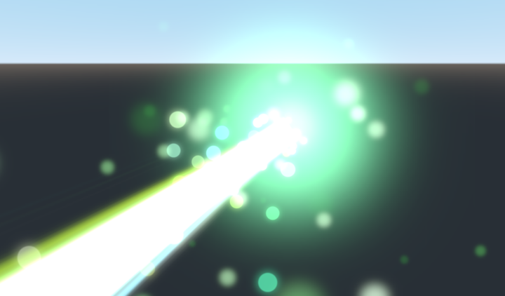
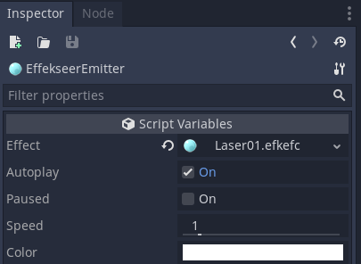
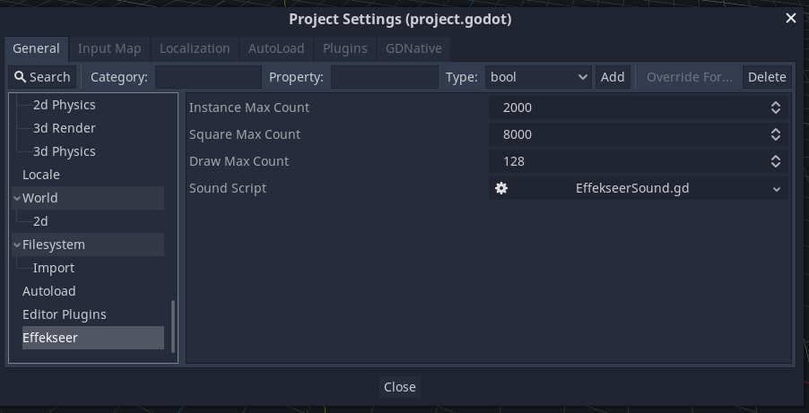

# How to use

## Install effekseer plugin

Copy the addons directory in EffekseerForGodot package into your Godot project.

Enable **Status** for **Effekseer for Godot** on the **Plugins** tab of **Project Settings**.

This completes the plugin installation.

## Resources

Copy your effect files (*.efkefc), textures, sounds, materials, etc. into the `res://` of your Godot project.

### Import effects
The *.efkefc file is imported as a Godot resource.

If successful, subresources such as textures, models and materials will be linked as shown above.

If the subresource is not linked, try re-importing.

#### scale setting
Sometimes the size of the loaded effect is small and you want to adjust the size. In that case, select the efkefc file, change the `scale` parameter on the Import tab and press the` Reimport` button.

You can change the size of the effect by changing the Scale of `EffekseerEmitter`, but this method may not be magnified depending on the effect settings.

## Emitter
Emitters are the source of effects and are used by placing them in a 3D scene.

To play the imported effect file, add `Node` with` Effekseer Emitter` attached to the node tree.

Then drag and drop the imported effect into the `Effect` property to specify it.

Since `Autoplay` is checked, the effect will be displayed when you run the scene.

### Emitter's inspector

| Property | Description                                 |
|----------|---------------------------------------------|
| Effect   | Sets the effect resource to play on the emitter |
| Autoplay | If checked, the effect will be played automatically at the start of the scene (`_ready ()` timing) |
| Paused   | Set the pause state during playback |
| Speed    | Set the playback speed of the effect |
| Color    | Set the color of the effect |

## Project settings

You can configure Effekseer's overall settings from Godot's project settings.

| Property           | Description            |
|--------------------|------------------------|
| Instance Max Count | Maximum number of instances generated by a node at the same time |
| Square Max Count   | Maximum number of rectangles used for drawing at the same time |
| Draw Max Count     | Maximum number of draw calls at the same time |
| Sound Script       | Script used for sound playback. Can be replaced |

