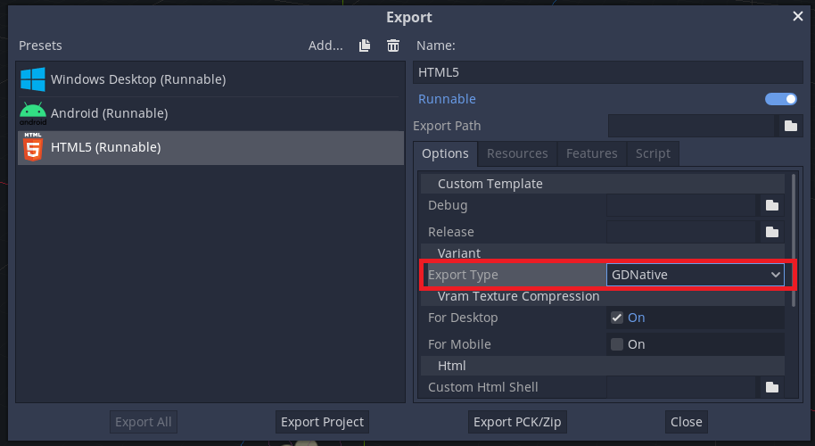

# FAQ

## 共通

### WARNING: poly has too many indices to draw, increase batch buffer size
2D描画時にこのような警告が出るときは、プロジェクト設定から`Batch Buffer Size`を増やしてください。

## Mobile (iOS/Android)

### 歪みシェーダとソフトパーティクルが動かない
モバイルターゲットでは次のEffekseerの機能は、デフォルト設定のままでは機能しません。

- 歪みシェーダ
- ソフトパーティクル

上記のエフェクトを機能させるためには、Godotの`プロジェクト設定`の`Quality`の`Framebuffer Allocation.mobile`に`3D`もしくは`2D`を設定する必要があります。

## HTML5

### HTML5で出力するとEffekseerが動かない
EffekseerプラグインをHTML5ターゲットで有効にするには`Export Type`を`GDNative`に設定する必要があります。

